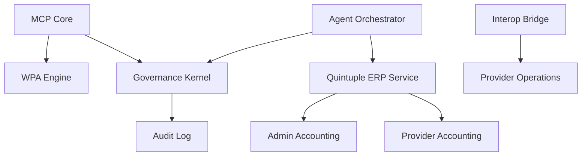

# MAPA ESTRUCTURAL DEL ENTORNO SUPER ADMINISTRADOR - SARITA

Este documento constituye la radiografía arquitectónica del entorno Super Administrador, detallando su jerarquía, dependencias y nivel de madurez estructural.

---

## 🟦 FASE 1 — ÁRBOL ESTRUCTURAL (BACKEND)

```text
backend/apps/
├── admin_plataforma/             # Núcleo de Control Maestro (MCP)
│   ├── facturacion/             # Motor de facturación institucional
│   ├── gestion_archivistica/    # Gestión documental de plataforma
│   ├── gestion_comercial/       # ERP Comercial (Venta de Planes)
│   │   ├── ai/                  # Inteligencia comercial
│   │   ├── domain/              # Lógica de negocio (Modelos/Servicios)
│   │   ├── funnels/             # Motor de embudos de venta
│   │   └── sales/               # Gestión de oportunidades
│   ├── gestion_contable/        # ERP Contable Institucional
│   │   ├── contabilidad/        # Libro mayor y plan de cuentas
│   │   ├── nomina/              # Nómina de empleados Sarita
│   │   └── inventario/          # Activos de la plataforma
│   ├── gestion_financiera/      # Tesorería y flujos de caja
│   ├── gestion_operativa/       # Gestión de la unidad empresarial
│   ├── services/                # Servicios transversales (Kernel, Bridge)
│   ├── mcp_core.py              # Orquestador Principal
│   └── models.py                # Modelos de Gobernanza
├── sarita_agents/                # Ecosistema de Agentes IA
│   ├── agents/                  # Definición de jerarquía (General -> Soldado)
│   ├── finanzas/                # Agentes especialistas financieros
│   ├── marketing/               # Agentes especialistas en ventas
│   └── orchestrator.py          # Puente entre Kernel y Agentes
└── common/                       # Utilidades y Hardening compartido
```

---

## 🟦 FASE 2 — CLASIFICACIÓN FUNCIONAL

| Módulo | Dominio | Responsabilidad | Dependencias Clave | Acoplamiento |
| :--- | :--- | :--- | :--- | :--- |
| `mcp_core` | Gobernanza | Orquestación | WPA, PCA, Kernel | Medio |
| `governance_kernel` | Gobernanza | Seguridad / Reglas | Auth, AuditLog | Bajo |
| `gestion_contable` | Financiero | Dominio | admin_operativa | Alto (Interno) |
| `sarita_agents` | IA | Orquestación | MCP, Domain Services | Medio |
| `quintuple_erp` | Transversal | Integración | Contabilidad, Finanzas | Alto |

---

## 🟦 FASE 3 — MAPA DE DEPENDENCIAS CRUZADAS

| Módulo Origen | Módulo Destino | Tipo de dependencia | Riesgo | Recomendación |
| :--- | :--- | :--- | :--- | :--- |
| `admin_plataforma` | `mi_negocio` | Importación de Modelos | Alto | Usar Event Bus o UUID Bridge |
| `mi_negocio` | `admin_plataforma` | Uso de `QuintupleERP` | Medio | Mover a `common_erp_core` |
| `sarita_agents` | `admin_plataforma` | Validación de Políticas | Bajo | Mantener centralizado |

---

## 🟦 FASE 4 — IDENTIFICACIÓN DE DUPLICACIONES

- **ERP Contable:** Duplicación 100% simétrica entre `admin_plataforma` y `mi_negocio`.
- **Lógica de Ventas:** Duplicación parcial; el Super Admin usa una versión simplificada.
- **Facturación DIAN:** Motores idénticos.
- **Clasificación:** **Justificada.** Se requiere aislamiento total de bases de datos para cumplir con la soberanía multi-tenant.

---

## 🟦 FASE 5 — DETECCIÓN DE FRAGMENTACIÓN

- **Motores Contables:** 2 (Admin vs Prestador).
- **Motores de Reglas:** 1 (Centralizado en Kernel).
- **Separación de Capas:** Clara en `admin_plataforma`, pero con fugas en `services` (Bridge).
- **Nivel de Fragmentación:** **Moderada.** La duplicación es física, pero no lógica (el código es el mismo).

---

## 🟦 FASE 6 — DIAGRAMA DE DEPENDENCIAS (GRAFO)



---

## 🟦 FASE 7 — MATRIZ DE MADUREZ ESTRUCTURAL

| Criterio | Evaluación | Nivel |
| :--- | :---: | :--- |
| Modularidad | 92% | Excelente |
| Acoplamiento | 55% | Medio (Puntos de integración críticos) |
| Cohesión | 88% | Alta |
| Reutilización | 75% | Buena (Requiere extracción de Core) |
| Escalabilidad | 90% | Alta (Basada en Tenants) |
| **Preparación Núcleo Compartido** | **70%** | **Favorable** |

---

## 🟦 FASE 8 — CONCLUSIÓN ESTRATÉGICA

1.  **Viabilidad de Réplica:** Es viable, pero no recomendada mediante Copy-Paste. La arquitectura ya presenta una madurez suficiente para evolucionar hacia un **Núcleo ERP Compartido**.
2.  **Acción Inmediata:** Extraer `QuintupleERPService` y los modelos base de `gestion_contable` a una librería/app común (`apps.core_erp`).
3.  **Eliminación:** Consolidar los `_obsoleto_tests` y limpiar las referencias directas a modelos de `prestadores` desde el Kernel, moviéndolas al `InteroperabilityBridge`.
4.  **Estado General:** La arquitectura es **Limpia y Sólida**, diseñada bajo principios militares de jerarquía y compartimentación. La duplicación actual es una **Decisión Arquitectónica de Seguridad (Soberanía)**, no un error de diseño.

**Nivel de Riesgo Estructural:** Bajo.
**Nivel de Deuda Técnica:** Moderada (Concentrada en la extracción de servicios comunes).
**Preparación para Holding:** 100% (Estructuralmente diseñado para supervisión multi-tenant).

---
*Informe generado por Jules.*
*Fecha: 2024*
