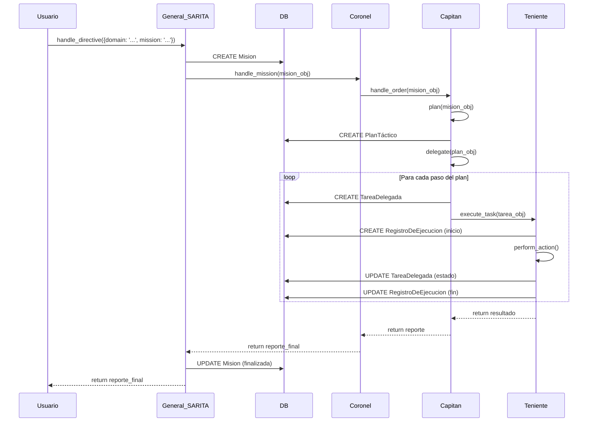

# Plan de Implementación Técnica de SARITA en Django

## 1. Resumen Técnico

Este documento traduce la arquitectura de agentes SARITA, previamente analizada y aprobada, en un plan de implementación técnico y concreto para el backend de Django.

Define los siguientes componentes clave:
1.  **Esquema de Modelos de Persistencia:** Las tablas de la base de datos necesarias para la auditoría y trazabilidad completa de las misiones.
2.  **Estructura de Clases y Servicios:** El diseño de las clases Python para cada nivel jerárquico (General, Coronel, Capitán, Teniente) y cómo interactuarán con los modelos de persistencia.
3.  **Diagrama de Secuencia:** El flujo de datos y de control de extremo a extremo para una misión típica.

Este plan es el paso final antes de la codificación de la lógica de los agentes.

## 2. Esquema de Modelos de Persistencia (`sarita_agents/models.py`)

Se crearán los siguientes modelos para asegurar una auditoría jerárquica robusta.

```python
import uuid
from django.db import models

class Mision(models.Model):
    """
    Registro de más alto nivel. Representa la directiva original del General.
    Es el ancla para toda la trazabilidad.
    """
    id = models.UUIDField(primary_key=True, default=uuid.uuid4, editable=False)
    directiva_original = models.JSONField(help_text="La directiva JSON original recibida por el orquestador.")
    dominio = models.CharField(max_length=100, help_text="Dominio de negocio objetivo (ej. 'prestadores').")
    estado = models.CharField(max_length=50, default='PENDIENTE', choices=[
        ('PENDIENTE', 'Pendiente'),
        ('EN_PROGRESO', 'En Progreso'),
        ('COMPLETADA', 'Completada'),
        ('FALLIDA', 'Fallida'),
    ])
    resultado_final = models.JSONField(null=True, blank=True, help_text="El informe final consolidado de la misión.")
    timestamp_inicio = models.DateTimeField(auto_now_add=True)
    timestamp_fin = models.DateTimeField(null=True, blank=True)

class PlanTáctico(models.Model):
    """
    El plan detallado generado por un Capitán para cumplir una misión.
    """
    id = models.UUIDField(primary_key=True, default=uuid.uuid4, editable=False)
    mision = models.ForeignKey(Mision, on_delete=models.CASCADE, related_name='planes_tacticos')
    capitan_responsable = models.CharField(max_length=255, help_text="Clase del Capitán que generó el plan.")
    pasos_del_plan = models.JSONField(help_text="Los pasos estructurados del plan.")
    estado = models.CharField(max_length=50, default='PLANIFICADO', choices=[
        ('PLANIFICADO', 'Planificado'),
        ('EN_EJECUCION', 'En Ejecución'),
        ('COMPLETADO', 'Completado'),
        ('FALLIDO', 'Fallido'),
    ])
    timestamp_creacion = models.DateTimeField(auto_now_add=True)

class TareaDelegada(models.Model):
    """
    Una tarea atómica individual delegada a un Teniente.
    """
    id = models.UUIDField(primary_key=True, default=uuid.uuid4, editable=False)
    plan_tactico = models.ForeignKey(PlanTáctico, on_delete=models.CASCADE, related_name='tareas')
    teniente_asignado = models.CharField(max_length=255, help_text="Identificador del Teniente responsable.")
    descripcion_tarea = models.TextField()
    parametros = models.JSONField(default=dict)
    estado = models.CharField(max_length=50, default='PENDIENTE', choices=[
        ('PENDIENTE', 'Pendiente'),
        ('EN_PROGRESO', 'En Progreso'),
        ('COMPLETADA', 'Completada'),
        ('FALLIDA', 'Fallida'),
    ])
    timestamp_creacion = models.DateTimeField(auto_now_add=True)

class RegistroDeEjecucion(models.Model):
    """
    Un log detallado de un intento de ejecución de una TareaDelegada.
    """
    id = models.UUIDField(primary_key=True, default=uuid.uuid4, editable=False)
    tarea_delegada = models.ForeignKey(TareaDelegada, on_delete=models.CASCADE, related_name='logs_ejecucion')
    timestamp = models.DateTimeField(auto_now_add=True)
    exitoso = models.BooleanField()
    salida_log = models.TextField(null=True, blank=True, help_text="Salida estándar o log de la ejecución.")
    resultado = models.JSONField(null=True, blank=True, help_text="El resultado estructurado de la ejecución.")
```

## 3. Estructura de Clases y Servicios (Stubs)

Las clases de los agentes serán refinadas para interactuar con la capa de persistencia.

```python
# --- orchestrator.py (General) ---
class SaritaOrchestrator:
    def handle_directive(self, directive: dict):
        # 1. Crear registro de Mision
        mision = Mision.objects.create(
            directiva_original=directive,
            dominio=directive.get("domain")
        )

        # 2. Delegar al Coronel
        coronel = self.coroneles.get(mision.dominio)
        reporte = coronel.handle_mission(mision) # Pasa el objeto Mision

        # 3. Actualizar y finalizar la Mision
        mision.resultado_final = reporte
        mision.estado = 'COMPLETADA' # o 'FALLIDA'
        mision.timestamp_fin = timezone.now()
        mision.save()
        return reporte

# --- coronel_template.py (Coronel) ---
class CoronelTemplate:
    def handle_mission(self, mision: Mision):
        # ... Lógica para seleccionar capitán ...
        capitan = self._select_capitan(mision.directiva_original)
        return capitan.handle_order(mision)

# --- capitan_template.py (Capitán) ---
class CapitanTemplate:
    def handle_order(self, mision: Mision):
        plan = self.plan(mision)
        resultados = self.delegate(plan)
        return self.report(resultados)

    def plan(self, mision: Mision) -> PlanTáctico:
        # Lógica para generar los pasos...
        pasos = {"step_1": "...", "step_2": "..."}

        # Crear y guardar el PlanTáctico en la BD
        plan_tactico = PlanTáctico.objects.create(
            mision=mision,
            capitan_responsable=self.__class__.__name__,
            pasos_del_plan=pasos
        )
        return plan_tactico

    def delegate(self, plan: PlanTáctico):
        for paso, desc in plan.pasos_del_plan.items():
            # 1. Crear TareaDelegada en la BD
            tarea = TareaDelegada.objects.create(
                plan_tactico=plan,
                teniente_asignado="...", # Determinar Teniente
                descripcion_tarea=desc
            )
            # 2. Ejecutar la tarea
            teniente = self._get_teniente_for_task(tarea)
            teniente.execute_task(tarea)
        # ...

# --- teniente_template.py (Teniente) ---
class TenienteTemplate:
    def execute_task(self, tarea: TareaDelegada):
        tarea.estado = 'EN_PROGRESO'
        tarea.save()

        log = RegistroDeEjecucion.objects.create(tarea_delegada=tarea, exitoso=False)
        try:
            # --- LÓGICA DE NEGOCIO REAL VA AQUÍ ---
            resultado = self.perform_action(tarea.parametros)

            tarea.estado = 'COMPLETADA'
            log.exitoso = True
            log.resultado = resultado
        except Exception as e:
            tarea.estado = 'FALLIDA'
            log.salida_log = str(e)

        tarea.save()
        log.save()
```

## 4. Diagrama de Secuencia de Misión

A continuación se muestra el flujo de control y datos para una directiva completa.


