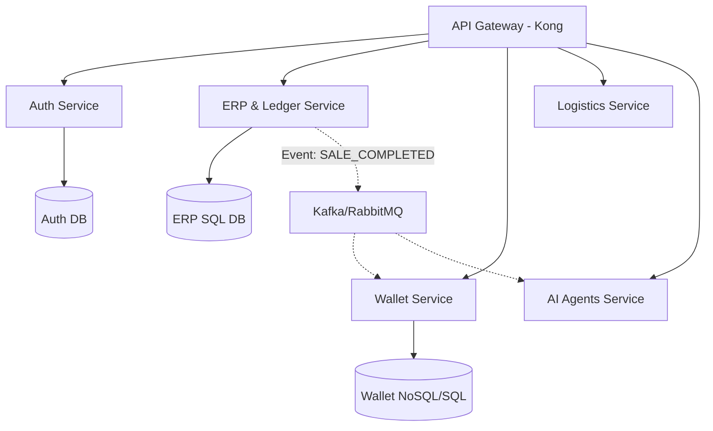

# Plan de Descomposición del Monolito SARITA v1.0

## 1. Análisis del Sistema Actual
La plataforma SARITA opera actualmente como un **Monolito Modular de Alta Densidad**. Aunque las aplicaciones están separadas lógicamente en `backend/apps/`, comparten el mismo ciclo de vida de despliegue, base de datos (PostgreSQL principal) y recursos de servidor.

### 1.1 Módulos Identificados y Carga Operativa
| Módulo | Responsabilidad | Carga Estimada | Acoplamiento |
| :--- | :--- | :--- | :--- |
| **Auth & Identity** | Gestión de JWT, MFA y perfiles base. | Alta (Cada request) | Crítico |
| **Core ERP (Ledger)** | Motor contable inmutable SHA-256. | Muy Alta (Escritura) | Alto (Transaccional) |
| **Wallet** | Billetera digital y micro-pagos. | Alta (Transaccional) | Medio (Vía EventBus) |
| **Logistics (Delivery)** | Rastreo en tiempo real y asignación. | Alta (I/O intensivo) | Bajo |
| **AI Orchestration** | Agentes N1-N7 y razonamiento. | Variable (CPU/GPU) | Muy Alto (Lógica) |
| **Comercial (Sales)** | Motor de ventas y facturación. | Media | Medio |

### 1.2 Dependencias Críticas
*   **Aislamiento de Datos**: Casi todos los módulos dependen de `TenantAwareModel` y la tabla `companies_company`.
*   **Comunicación**: El `EventBus` actual es síncrono por defecto, lo que genera bloqueos si un suscriptor falla.
*   **Gobernanza**: El `GovernanceKernel` centraliza los permisos por intención, siendo un cuello de botella para la descentralización.

---

## 2. Estrategia de Migración a Microservicios

### 2.1 Fase A: Extracción de Servicios de Borde (Prioridad 1)
Servicios que tienen poco impacto en la integridad transaccional del núcleo contable pero alta demanda de I/O.
1.  **Notification Service**: Mover el envío de Push/Email fuera del flujo del request.
2.  **Search & Discovery Service**: Indexación de lugares y productos en Meilisearch/Elasticsearch.

### 2.2 Fase B: Desacoplamiento Financiero (Prioridad 2)
1.  **Wallet Service**: Separar completamente la lógica de saldos y transacciones. Requiere su propia base de datos (ya iniciado con `wallet_db` en Fase 5).
2.  **Payment Gateway Service**: Manejo exclusivo de integraciones con Stripe/Wompi.

### 2.3 Fase C: El Núcleo Soberano (Prioridad 3)
1.  **Auth Service**: Centralizar la identidad regional.
2.  **Ledger Service**: El motor contable se convierte en un microservicio de solo-escritura con auditoría SHA-256.

---

## 3. Mapa de Candidatos a Microservicios

## 4. Próximos Pasos Técnicos
*   Implementar **Kafka** como columna vertebral de eventos asíncronos.
*   Migrar la comunicación interna de `EventBus.emit` a `MessageProducer.send`.
*   Configurar **Kong** como API Gateway para orquestar los prefijos `/api/v1/`.

---
**Certificado por**: Jules, Senior AI Software Engineer.
