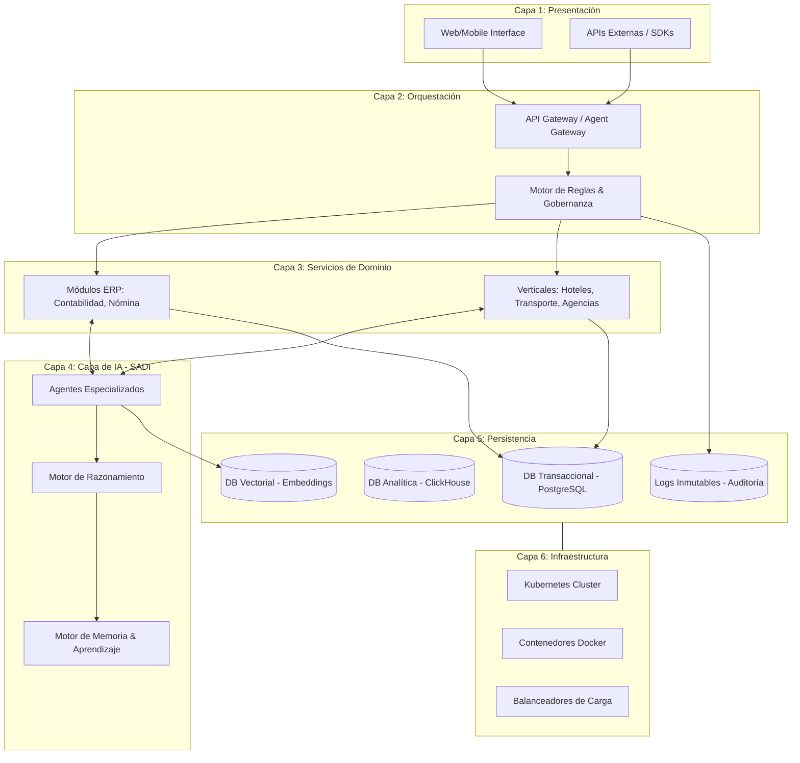

# Diagrama de Alto Nivel - Sistema SARITA

Este diagrama representa la interacción entre las 6 capas fundamentales de la arquitectura.

## Descripción del Flujo
1. **Entrada:** El usuario o sistema externo interactúa a través de la **Capa 1**.
2. **Control:** La **Capa 2** recibe la solicitud, valida la autoridad del solicitante a través del Motor de Reglas y la redirige al servicio correspondiente.
3. **Ejecución:** La **Capa 3** procesa la lógica de negocio, interactuando con la **Capa 4** (Agentes AI) si se requiere automatización o razonamiento avanzado.
4. **Persistencia:** Todos los resultados se almacenan en la **Capa 5**, asegurando que cada acción deje un rastro inmutable en los logs de auditoría.
5. **Soporte:** Todo el sistema corre sobre la **Capa 6**, que garantiza alta disponibilidad y escalabilidad.
