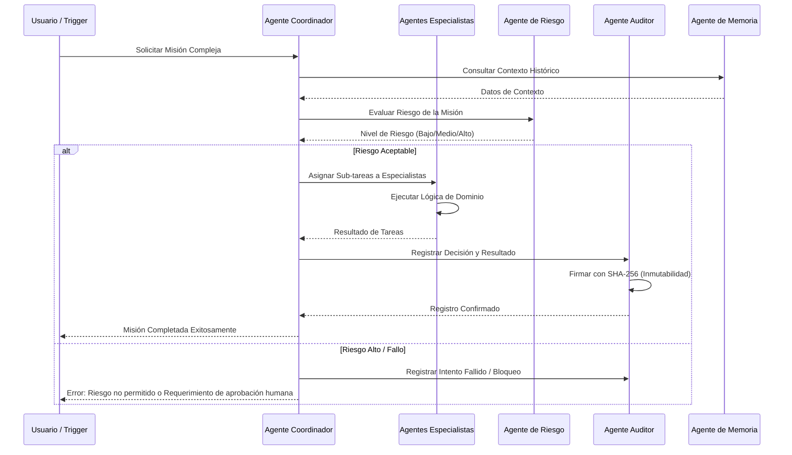

# Modelo de Agentes AI e Interacción - Sistema SARITA

## 1. Tipología de Agentes
El sistema SARITA utiliza una jerarquía militarizada y funcional de agentes para garantizar el orden y la eficiencia.

### 1.1 Agente Coordinador (Coronel)
- **Rol:** Orquestador de misiones complejas que involucran múltiples módulos.
- **Límite de Autoridad:** Supervisa Capitanes y Tenientes. No puede modificar saldos financieros directamente sin validación del Auditor.
- **Nivel de Autonomía:** Alta (Toma decisiones de flujo de trabajo).

### 1.2 Agentes Especialistas (Tenientes / Sargentos)
- **Rol:** Expertos en un dominio específico (e.g., `TenienteHoteles`, `SargentoInventario`).
- **Límite de Autoridad:** Restringido a su módulo de dominio.
- **Nivel de Autonomía:** Media (Ejecuta acciones basadas en reglas predefinidas).

### 1.3 Agente Auditor
- **Rol:** Verificación forense de cada transacción y decisión tomada por otros agentes.
- **Límite de Autoridad:** Soberana sobre registros de log. Puede bloquear transacciones sospechosas.
- **Nivel de Autonomía:** Independiente.

### 1.4 Agente de Riesgo
- **Rol:** Evaluación de impacto y probabilidad de fallo en operaciones críticas.
- **Límite de Autoridad:** Informativa y Preventiva.
- **Nivel de Autonomía:** Consultiva.

### 1.5 Agente de Optimización
- **Rol:** Analiza patrones de datos para sugerir mejoras en la eficiencia operativa.
- **Límite de Autoridad:** Sugerencia (Nivel 1).
- **Nivel de Autonomía:** Analítica.

### 1.6 Agente de Memoria
- **Rol:** Gestión del contexto histórico del usuario y del sistema (RAG).
- **Límite de Autoridad:** Lectura/Escritura sobre la base de datos vectorial.
- **Nivel de Autonomía:** Soporte.

### 1.7 Agente de Cumplimiento Normativo (Compliance)
- **Rol:** Asegura que todas las acciones cumplan con las regulaciones locales y fiscales (e.g., DIAN).
- **Límite de Autoridad:** Bloqueante. Si una acción no cumple, se detiene.

---

## 2. Diagrama de Interacción de Agentes

---

## 3. Protocolos de Seguridad y Trazabilidad de Agentes

### 3.1 Registro Obligatorio de Decisiones (Decision Log)
Cada decisión tomada por un agente debe registrarse en la tabla `IntentosNegocio` con los siguientes campos:
- `UUID` único de intención.
- `AgenteID` y `NivelAutoridad`.
- `Input` (Parámetros recibidos).
- `Razonamiento` (Breve explicación del "por qué").
- `Resultado` (Éxito/Fallo).
- `Hash SHA-256` del registro previo para asegurar la cadena de custodia.

### 3.2 Sistema de Rollback
En caso de fallo en una misión multi-agente, el Agente Coordinador debe ejecutar el protocolo de compensación (Saga Pattern) para revertir los cambios parciales en los módulos afectados.

### 3.3 Límites de Autonomía
- **OPERATIONAL (Nivel 1):** Acciones automáticas sin supervisión.
- **DELEGATED (Nivel 2):** Requiere confirmación de un agente superior.
- **SOVEREIGN (Nivel 3):** Requiere aprobación humana o firma criptográfica.
