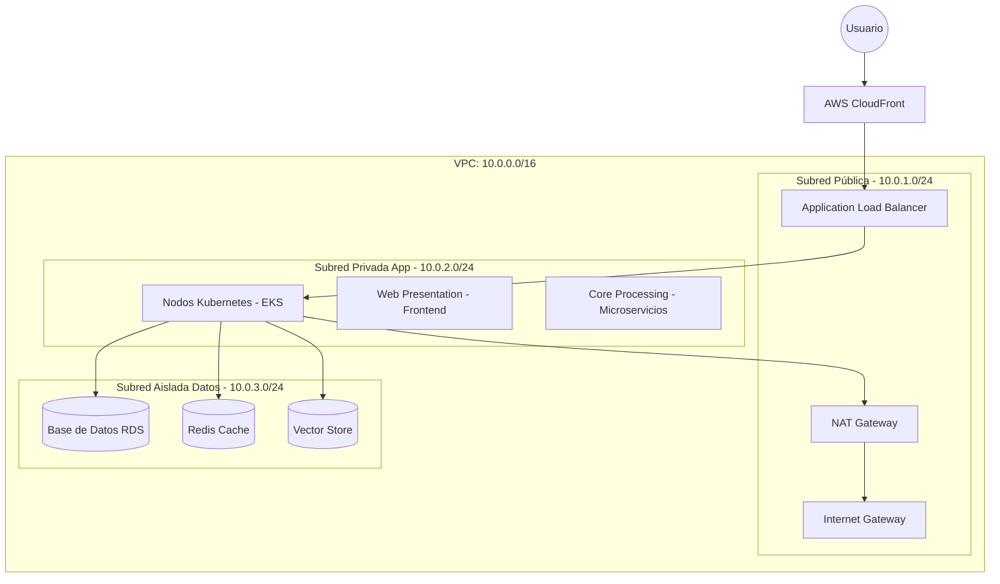

# Diagrama de Red y Segmentación - Sistema SARITA

## 1. Estructura de la VPC
Se implementa una **VPC (Virtual Private Cloud)** dedicada con un rango de red CIDR `10.0.0.0/16`.

## 2. Segmentación y Reglas de Acceso

### 2.1 Subred Pública
- **Contenido:** Application Load Balancer (ALB), NAT Gateways.
- **Acceso:** Recibe tráfico HTTPS (Puerto 443) desde internet.
- **Seguridad:** Protegido por AWS WAF.

### 2.2 Subred Privada (Aplicaciones)
- **Contenido:** Nodos de EKS donde corren MCP, PCA y WPA.
- **Acceso:** Solo permite tráfico desde el ALB en la subred pública.
- **Salida:** Acceso a internet controlado a través del NAT Gateway (para parches y APIs externas).

### 2.3 Subred Aislada (Datos)
- **Contenido:** Instancias de base de datos y cache.
- **Acceso:** **ESTRICTAMENTE LIMITADO** a las IPs de la subred privada de aplicaciones. No tiene acceso a internet (sin ruta de salida).

## 3. Políticas de Red (Network Policies - K8s)
Dentro del clúster de Kubernetes, se aplican políticas para restringir el tráfico "East-West":
- **WPA (Frontend):** No puede hablar directamente con la Base de Datos. Debe pasar por el PCA (Backend).
- **PCA (Microservicios):** Puede hablar con la DB y otros microservicios autorizados.
- **MCP (Admin):** Acceso restringido a IPs administrativas/VPN.

## 4. Conectividad Externa (VPN/Direct Connect)
Para acceso administrativo y de mantenimiento, se utiliza un **AWS Client VPN** que conecta directamente a la subred privada de aplicaciones, evitando la exposición de puertos SSH o dashboards de administración a internet pública.
