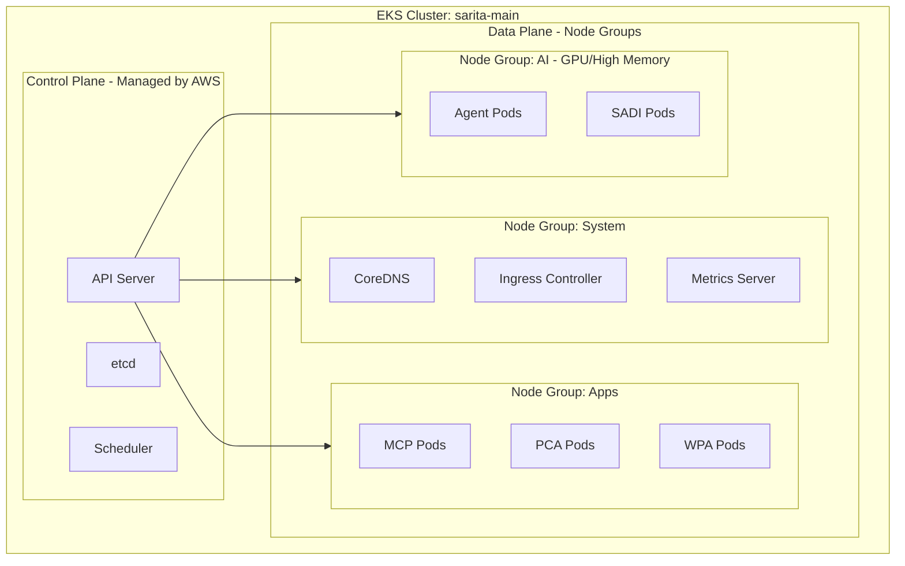

# Diseño de Clúster Kubernetes y Orquestación - Sistema SARITA

## 1. Arquitectura del Clúster (Amazon EKS)
Se utiliza un clúster de EKS gestionado para eliminar la carga operativa de mantener el Control Plane.

## 2. Organización por Namespaces
El clúster se segmenta lógicamente para aislar entornos y responsabilidades:
- `kube-system`: Componentes del sistema Kubernetes.
- `sarita-infra`: Ingress, Monitoreo, Logging.
- `sarita-dev`: Entorno de desarrollo.
- `sarita-stage`: Entorno de pre-producción.
- `sarita-prod`: Entorno de producción (Aislamiento máximo).

## 3. Estrategias de Escalabilidad

### 3.1 Horizontal Pod Autoscaler (HPA)
Escala el número de réplicas de los Pods basado en el consumo de CPU y Memoria (Umbral: 70%).

### 3.2 Vertical Pod Autoscaler (VPA)
Ajusta los límites de recursos de los Pods basándose en el uso histórico (ideal para servicios de IA).

### 3.3 Cluster Autoscaler / Karpenter
Añade o elimina nodos físicos (instancias EC2) al clúster automáticamente cuando no hay recursos disponibles para programar nuevos Pods.

## 4. Gestión de Despliegues (Rollouts)
- **Estrategia:** `RollingUpdate`.
- **MaxSurge:** 25% (Añade un 25% más de capacidad durante el deploy).
- **MaxUnavailable:** 0% (Nunca quita capacidad existente antes de que los nuevos Pods estén listos).
- **Health Checks:**
  - `LivenessProbe`: Reinicia el contenedor si falla.
  - `ReadinessProbe`: Detiene el tráfico al contenedor si no está listo.

## 5. Ingress Controller
Se utiliza **AWS Load Balancer Controller** integrado con **Nginx Ingress** para manejar el enrutamiento basado en nombres de dominio (e.g., `api.sarita.com`, `admin.sarita.com`).
- Terminación TLS en el ALB (Certificados vía AWS ACM).
- Reglas de reescritura de URL para microservicios.
- Autenticación básica o JWT en el Ingress para servicios internos.
