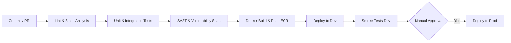

# Pipeline CI/CD y Automatización - Sistema SARITA

## 1. Estrategia de Entrega Continua
Se implementa un pipeline automatizado basado en **GitHub Actions** para garantizar que cada cambio en el código sea validado y desplegado de forma segura.

## 2. Etapas del Pipeline

### 2.1 Validación de Código
- **Linter:** `flake8` / `black` para Python, `eslint` / `prettier` para TypeScript.
- **Análisis Estático:** `SonarCloud` para calidad de código y detección de bugs.

### 2.2 Seguridad en el Pipeline
- **Escaneo de Dependencias:** `Snyk` para detectar librerías vulnerables.
- **Escaneo de Imágenes:** `Trivy` analiza la imagen Docker antes de subirla al registro (ECR).
- **Secret Detection:** `gitleaks` para prevenir la subida accidental de secretos al repositorio.

### 2.3 Construcción (Build)
- Generación de imágenes Docker multi-etapa (multi-stage) para minimizar el tamaño de la imagen final.
- Etiquetado (Tagging): `sha-${GITHUB_SHA}` para inmutabilidad y `latest` para el entorno de desarrollo.

### 2.4 Despliegue (CD)
- **Herramienta:** `kubectl` / `Helm` para gestionar los manifiestos de Kubernetes.
- **Canary / Blue-Green:** (Opcional) Implementado mediante el Ingress para despliegues progresivos en producción.

## 3. Promoción entre Entornos
1. **Desarrollo (Dev):** Despliegue automático tras cada merge a la rama `develop`.
2. **Staging:** Despliegue automático tras cada merge a la rama `main`. Refleja exactamente la configuración de producción.
3. **Producción (Prod):** Requiere aprobación manual (Aprobación de 2 ingenieros) y debe pasar todas las pruebas de Staging.

## 4. Notificaciones
- Integración con Slack/Microsoft Teams para informar sobre el estado de los despliegues (Éxito/Fallo).
- Alertas inmediatas en caso de fallo en la etapa de Seguridad o Producción.
