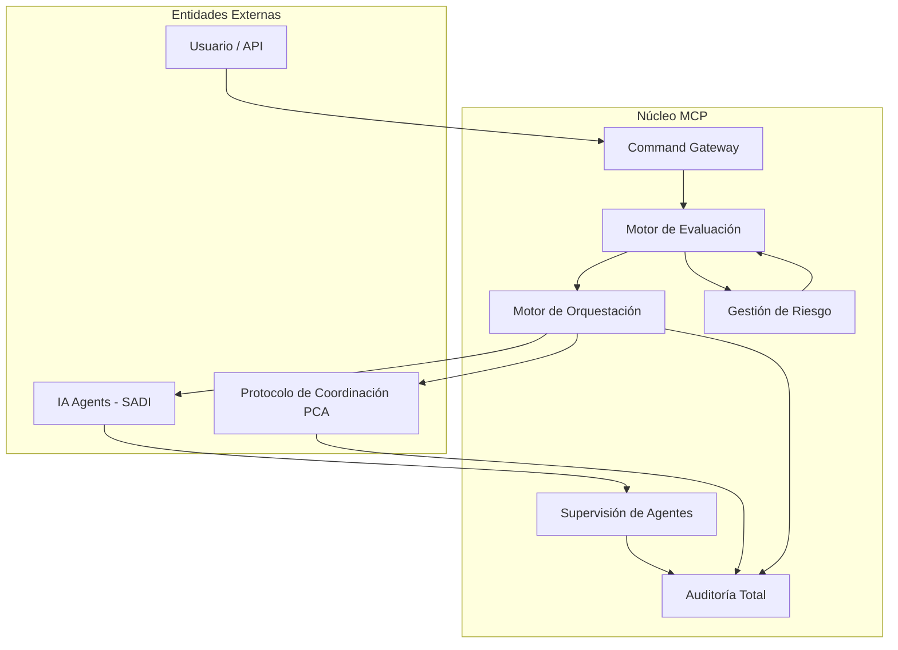
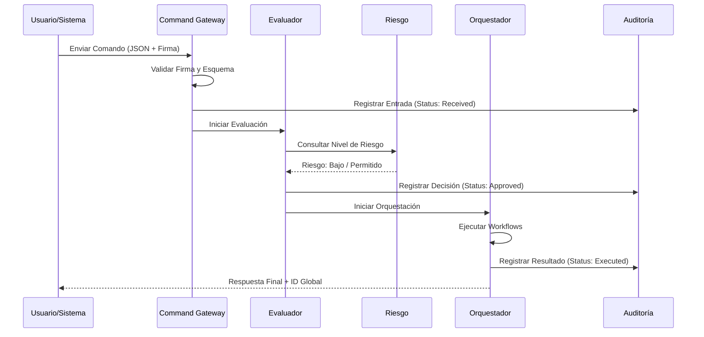
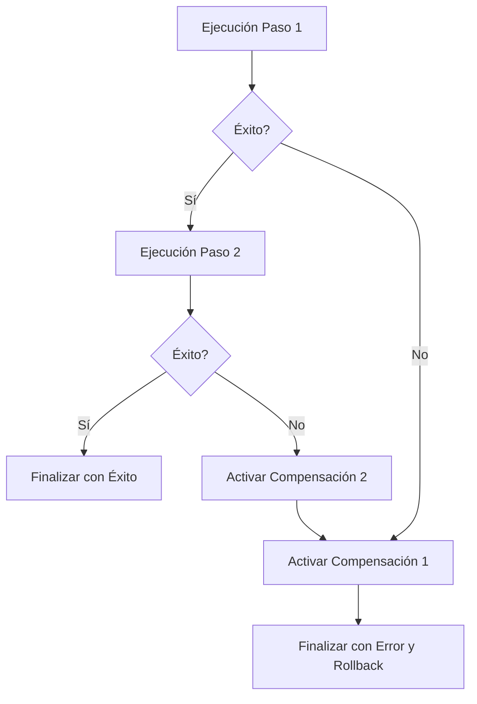

# Diagrama de Módulos e Interacción del MCP

## 1. Mapa de Módulos Internos

```mermaid
graph TB
    subgraph MCP_Core [Núcleo MCP]
        Gateway[Command Gateway]
        Eval[Motor de Evaluación]
        Orch[Motor de Orquestación]
        Super[Supervisión de Agentes]
        Audit[Auditoría Total]
        Risk[Gestión de Riesgo]
    end

    subgraph External_Entities [Entidades Externas]
        User[Usuario / API]
        PCA[Protocolo de Coordinación PCA]
        SADI[IA Agents - SADI]
    end

    User --> Gateway
    Gateway --> Eval
    Eval --> Risk
    Risk --> Eval
    Eval --> Orch
    Orch --> PCA
    Orch --> SADI
    SADI --> Super
    Super --> Audit
    PCA --> Audit
    Orch --> Audit
```

## 2. Flujo de Ejecución de un Comando (Sequence Diagram)

```mermaid
sequenceDiagram
    participant U as Usuario/Sistema
    participant G as Command Gateway
    participant E as Evaluador
    participant R as Riesgo
    participant O as Orquestador
    participant A as Auditoría

    U->>G: Enviar Comando (JSON + Firma)
    G->>G: Validar Firma y Esquema
    G->>A: Registrar Entrada (Status: Received)
    G->>E: Iniciar Evaluación
    E->>R: Consultar Nivel de Riesgo
    R-->>E: Riesgo: Bajo / Permitido
    E->>A: Registrar Decisión (Status: Approved)
    E->>O: Iniciar Orquestación
    O->>O: Ejecutar Workflows
    O->>A: Registrar Resultado (Status: Executed)
    O-->>U: Respuesta Final + ID Global
```

## 3. Protocolo de Manejo de Errores y Rollback

```mermaid
graph TD
    Step1[Ejecución Paso 1] --> Success1{Éxito?}
    Success1 -- Sí --> Step2[Ejecución Paso 2]
    Success1 -- No --> Rollback1[Activar Compensación 1]

    Step2 --> Success2{Éxito?}
    Success2 -- Sí --> End[Finalizar con Éxito]
    Success2 -- No --> Rollback2[Activar Compensación 2]
    Rollback2 --> Rollback1
    Rollback1 --> Fail[Finalizar con Error y Rollback]
```
