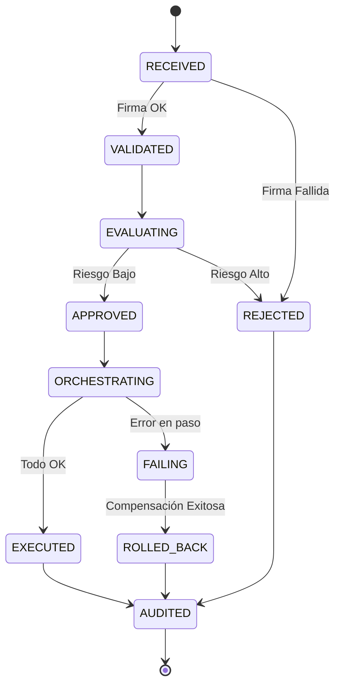

# Modelo de Estados del Ciclo de Vida del Comando (MCP)

El MCP gestiona un modelo de estados persistente para cada comando recibido, garantizando que ninguna acción quede en un limbo operativo.

## 1. Mapa de Estados

| Estado | Descripción | Transición Siguiente |
| :--- | :--- | :--- |
| **`RECEIVED`** | El comando ha entrado al Gateway. | `VALIDATED` o `REJECTED` |
| **`VALIDATED`** | Firma y esquema correctos. | `EVALUATING` |
| **`EVALUATING`** | Consultando motores de riesgo y cumplimiento. | `APPROVED` o `REJECTED` |
| **`APPROVED`** | Acción autorizada por el MCP. | `ORCHESTRATING` |
| **`REJECTED`** | Acción denegada (Riesgo/Seguridad). | `AUDITED` (Terminal) |
| **`ORCHESTRATING`** | Ejecutando pasos en el PCA/SADI. | `EXECUTED` o `FAILING` |
| **`EXECUTED`** | Flujo completado con éxito. | `AUDITED` (Terminal) |
| **`FAILING`** | Error detectado, iniciando Rollback. | `ROLLED_BACK` |
| **`ROLLED_BACK`** | Compensación finalizada. | `AUDITED` (Terminal) |
| **`AUDITED`** | Registro final inmutable cerrado. | N/A |

## 2. Diagrama de Transición de Estados

## 3. Persistencia de Estado
Cada cambio de estado debe quedar registrado en la tabla `MCP_State_History` con:
- Timestamp exacto.
- Razón de la transición (ej: "SADI confirma disponibilidad").
- ID del agente o componente que disparó el cambio.
