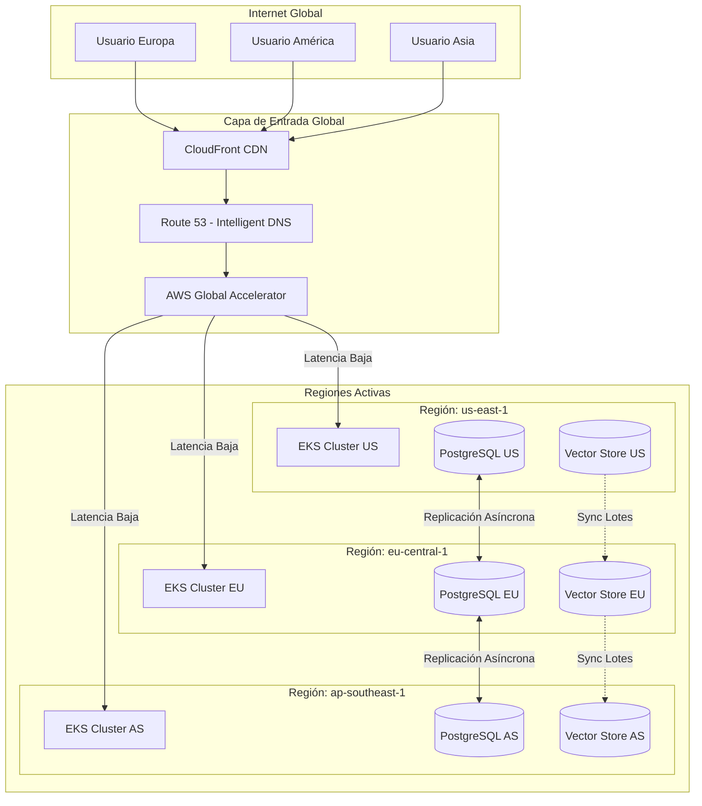

# Diagrama Global de Infraestructura - Sistema SARITA

## 1. Topología Mundial

## 2. Flujo de Solicitud Internacional
1. El usuario accede a `app.sarita.com`.
2. **CloudFront** sirve los componentes de la UI (WPA) desde el punto de presencia más cercano.
3. **Route 53** resuelve la IP del **Global Accelerator** basándose en la latencia.
4. La solicitud viaja por la red privada de AWS hacia el microservicio correspondiente en la región óptima.
5. Si los datos requeridos no están en la región local, el microservicio realiza una consulta inter-regional protegida por mTLS.

## 3. Aislamiento y Resiliencia
- Cada región es **Self-Healing**. Un fallo en el clúster de US no afecta el funcionamiento de EU o AS.
- Los planos de control de Kubernetes son independientes por región para evitar fallos de orquestación en cascada.
