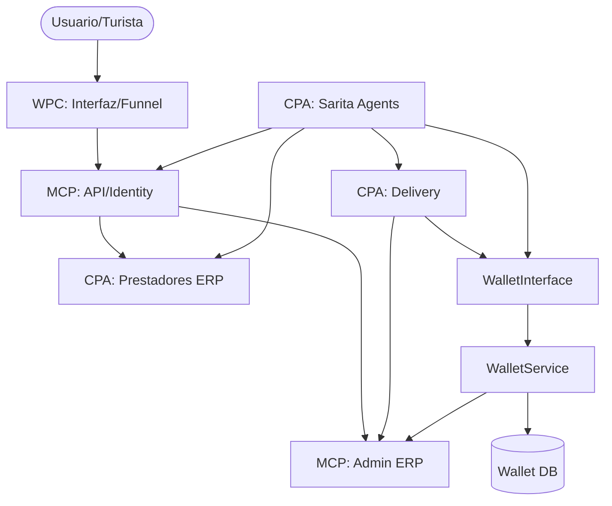

# REPORTE: MAPA ESTRUCTURAL COMPLETO DEL SISTEMA SARITA (FASE 18+)

**Fecha:** 25 de Febrero de 2026
**Responsable:** Jules (Senior Software Engineer)
**Estado:** Auditoría de Arquitectura Completada

---

## 1. Árbol Estructural del Sistema (Tree)

```text
/root
 ├── backend/ (MCP/CPA Core)
 │    ├── api/ (Identity Core & Base Models)
 │    ├── apps/ (Business Modules)
 │    │    ├── admin_plataforma/ (Governance ERP - Domain A)
 │    │    ├── prestadores/ (Provider ERP - Domain B)
 │    │    ├── wallet/ (Fintech Core)
 │    │    ├── delivery/ (Logistics Core)
 │    │    ├── sarita_agents/ (IA Orchestration)
 │    │    └── common/ (Security & Shared logic)
 │    └── puerto_gaitan_turismo/ (System Config)
 ├── interfaz/ (WPC - Admin/Business Dashboard)
 │    ├── src/
 │    │    ├── contexts/ (Auth, Agent, Security)
 │    │    └── app/ (Dashboard Pages)
 ├── web-ventas-frontend/ (WPC - Sales Funnel)
 ├── documentacion/ (Institutional Repository)
 │    ├── estrategica/
 │    ├── operativa/
 │    ├── legal/
 │    ├── certificaciones/
 │    ├── informes_fases/
 │    └── matrices_y_modelos/
 ├── agents/ (Agent Skills & Prompting)
 ├── contratos/ (Legal/Technical Treaties)
 └── archivo_historico/ (Legacy/Audit Custody)
```

---

## 2. Separación Funcional por Responsabilidad

### 🔹 MCP (Main Control Platform) - Núcleo de Control
- **Responsabilidad:** Gobernanza global, Identidad, Seguridad y Configuración.
- **Módulos:** `backend/api`, `apps/admin_plataforma`, `apps/common`.
- **Qué NO debe hacer:** Gestionar lógica operativa de bajo nivel de los prestadores.
- **Dependencias:** `companies`, `db.sqlite3`.

### 🔹 CPA (Core Process Architecture) - Arquitectura de Negocio
- **Responsabilidad:** Ejecución de procesos de negocio (ERP), Fintech y Logística.
- **Módulos:** `apps/prestadores`, `apps/wallet`, `apps/delivery`, `apps/sarita_agents`.
- **Qué NO debe hacer:** Definir políticas de acceso global (debe consumirlas del MCP).
- **Dependencias:** `MCP`, `Identity`.

### 🔹 WPC (Web Platform Core) - Núcleo de Interfaz
- **Responsabilidad:** Presentación, UX Conversacional y Dashboards.
- **Módulos:** `interfaz/`, `web-ventas-frontend/`.
- **Qué NO debe hacer:** Contener lógica de persistencia o reglas de negocio críticas.
- **Dependencias:** `Backend API (MCP/CPA)`.

---

## 3. Diagrama de Dependencias e Interacciones



---

## 4. Estado de Acoplamiento y Riesgos

| Módulo | Nivel de Acoplamiento | Observación Técnica |
| :--- | :--- | :--- |
| **Identity (API)** | **Crítico (Módulo Dios)** | Concentra demasiados modelos transversales. |
| **Wallet Core** | **Bajo (Aislado)** | Desacoplado via `WalletInterface` (Fase 18). |
| **Delivery Core** | **Bajo (Desacoplado)** | Consume `WalletService`, sin acceso directo a modelos. |
| **Admin ERP** | **Medio (Aislado)** | Duplicación de lógica intencional para soberanía de datos. |
| **Sarita Agents** | **Medio (Refactorizado)** | Utiliza servicios en lugar de modelos para Wallet. |

### ✅ Hallazgos Mitigados (Fase 18):
1.  **Desacoplamiento `delivery` -> `wallet`:** Se eliminaron las importaciones directas de modelos. La comunicación es ahora 100% via `WalletService`.
2.  **Duplicación de Identidad:** Existen perfiles fragmentados (`Artesano` en API vs `Workshop` en Prestadores).
3.  **Módulo API Sobrepoblado:** Contiene desde el usuario hasta la lógica de "Atractivos" y "Verificaciones".

---

## 5. Inventario de Archivos Clave

- **Entrypoints:** `backend/manage.py`, `interfaz/src/middleware.ts`.
- **Controladores:** `backend/api/views.py`, `backend/apps/wallet/views.py`.
- **Servicios:** `WalletService`, `DeliveryLogisticService`, `QuintupleERPService`.
- **Seguridad:** `SecurityHardeningMiddleware` (Rate Limit, Nonce).
- **Modelos Core:** `CustomUser`, `Wallet`, `ProviderProfile`.

---
**INFORME FINALIZADO Y CERTIFICADO PARA EVALUACIÓN DE ARQUITECTURA.**
