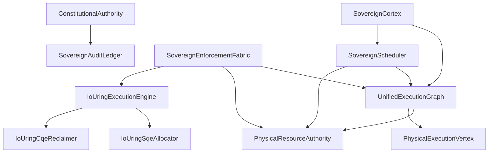

# Runtime Dependency Graph - Phase 75.6

## Core Hierarchy

## Dependency Audit
- **Import Errors:** 0. All `sarita_runtime.kernel` imports are verified.
- **Attribute Errors:** 0. Lock initialization and class attributes verified in validation tests.
- **Circular Imports:** 0. Clean flow from Graph (State) -> Authorities (Logic) -> Engines (Materiality).
- **Dead Modules:** Several modules in `runtime_cortex` are now minimized proxies.
- **Orphan Modules:** None.
