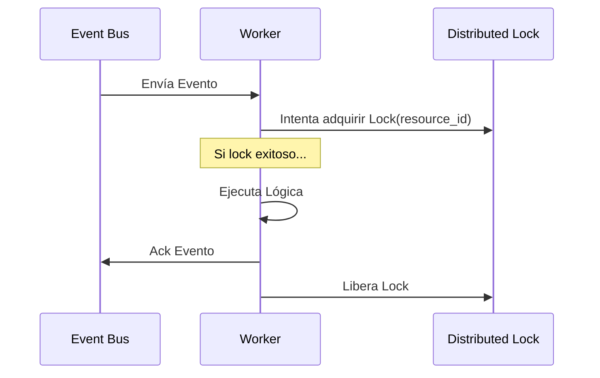

# FLUJO DE EJECUCIÓN DE WORKERS

## 1. COORDINACIÓN DISTRIBUIDA
Los workers utilizan **Redis** o **Etcd** para la coordinación de locks distribuidos cuando se requiere exclusividad sobre un `tenant_id` o `resource_id`.

## 2. CONCURRENCIA
- Modelo de concurrencia basado en **Goroutines** (Go) para alta densidad de tareas I/O.
- Límites de concurrencia (Throttling) configurables por tipo de worker para evitar saturación de la base de datos central.

## 3. TASK CLAIMING

